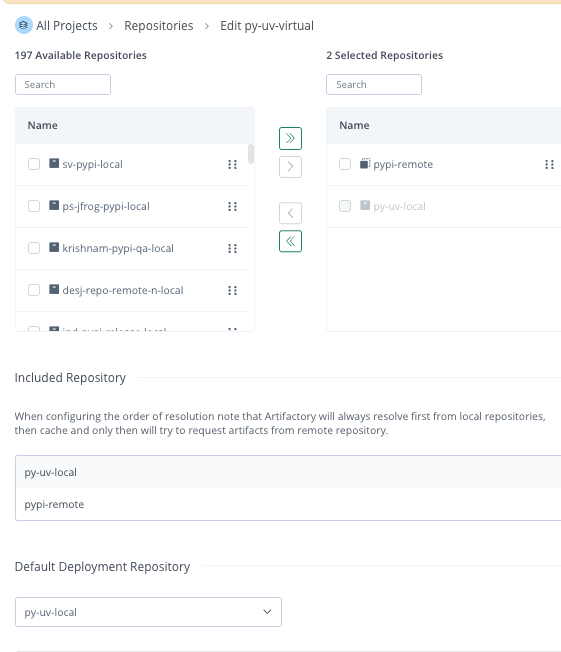
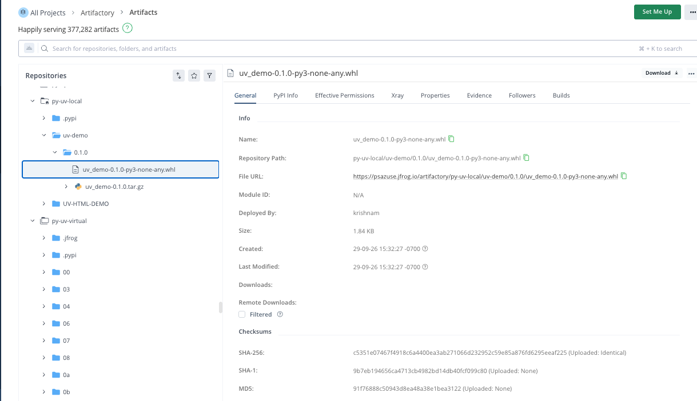

# python.uv
This repository demonstrates how to manage and build a Python project using uv




## UV Native commands
### Build
```
./jfcli.sh
```

#### Artifact upload


### Build Publish


## Reference
 - https://docs.jfrog.com/artifactory/docs/jf-uv
 - https://docs.jfrog.com/artifactory/docs/pypi-repositories#uv-client